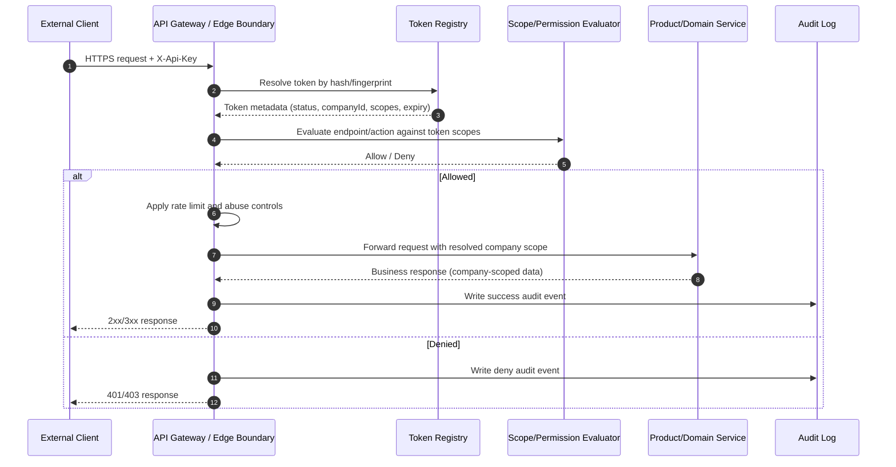

# Architecture overview

## High-level architecture
The reference design separates the external access boundary from internal product services. An edge layer authenticates inbound API keys, resolves company ownership, evaluates scope/permissions, and emits audit events before invoking product/domain services with a platform-resolved company context.

This model centralizes external authorization controls and reduces the chance that tenant isolation logic is inconsistently implemented across product teams.

## Main actors
- **External client**: partner or customer-controlled system calling exposed endpoints.
- **API gateway / edge boundary**: first trusted boundary for inbound request validation, layered rate limiting, abuse controls, and policy enforcement.
- **External API surface**: stable, documented contract intended for external consumption.
- **Token registry**: authoritative store of token hash, ownership, status, and lifecycle metadata.
- **Scope/permission evaluator**: policy component that validates token scopes against endpoint/action requirements. The scope and permission model defines required endpoint scopes, deny-by-default behavior, resource boundaries, and audit expectations.
- **Audit log**: append-only event stream/store for authentication, authorization, company/resource boundary decisions, sensitive operations, and rate-limit outcomes.
- **Product/domain services**: internal services that execute business operations under resolved company scope.

## Request flow
1. Receive request with `X-Api-Key`.
2. Derive secure hash/fingerprint and resolve token record in token registry.
3. Identify owning company from token record.
4. Evaluate token status, expiration, and required scope/permission.
5. Apply layered rate limiting and abuse controls by token, company, endpoint, operation type, and safety limits.
6. Invoke product service using platform-resolved company scope.
7. Write audit event containing token ID/fingerprint, company ID, endpoint, decision, and timestamp.

## Sequence diagram

