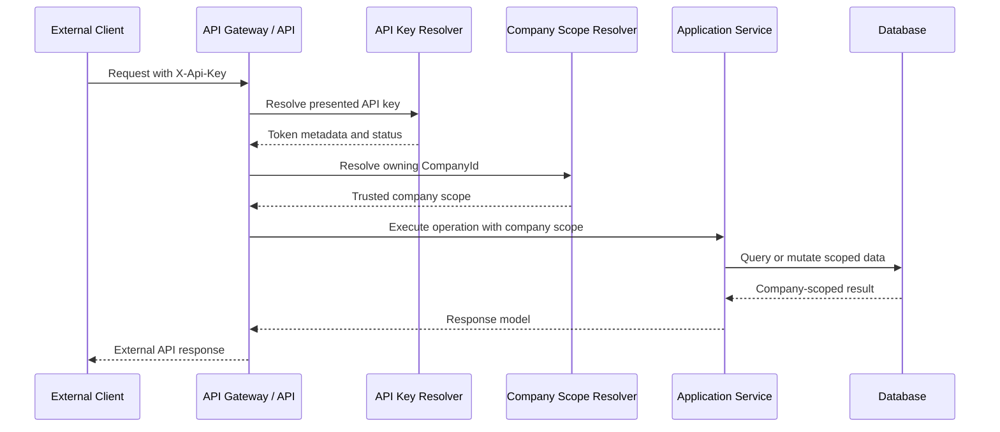

# External API Access Model

External API access is company-scoped. An external client authenticates with an `X-Api-Key` header, and the platform resolves that API key to the owning company before any application data is returned.

## Architectural Principle

When a request arrives with `X-Api-Key`, the system resolves the token to its owning `CompanyId` and scopes all returned data to that company. The client must not be trusted to provide or override `CompanyId`.

## Internal Users vs External Clients

Internal users operate through internal tools, admin workflows, or internal APIs. Their access model may include employee identity, operational roles, approval workflows, and elevated support actions.

External clients are systems outside the platform boundary. They should receive only a curated external API contract and should be authorized through platform-issued credentials, explicit scopes, and company ownership metadata.

These access paths should be evaluated separately. Internal authorization should not be copied directly into an external API.

## Company-Scoped API Keys

An API key belongs to exactly one company. The key record stores trusted metadata such as:

- owning `CompanyId`,
- key prefix or identifier,
- token hash,
- status,
- scopes,
- expiry,
- lifecycle timestamps.

The API key is not a portable global credential. It represents a specific external access grant for a specific company.

## API Key Ownership

Ownership is assigned by the platform when the key is generated. The external client may name or label a key for operational clarity, but it does not decide the owning company.

Ownership matters because it drives:

- data isolation,
- permission evaluation,
- audit log attribution,
- rate limiting,
- token lifecycle operations,
- incident investigation.

## Why External Clients Must Not Choose CompanyId

External clients are not trusted to provide company identity. A request body, query parameter, or header such as `CompanyId`, `company_id`, or `X-Company-Id` can be spoofed or accidentally misconfigured.

If a platform accepts caller-provided company identity for external API authorization, a client could attempt to access another company's data by changing a request field. Even when other checks exist, this creates unnecessary ambiguity and makes audit review harder.

The external API may accept business identifiers that are part of the endpoint contract, but these identifiers must be interpreted inside the already-resolved company scope.

## Resolving CompanyId from X-Api-Key

The API gateway or API layer receives the raw token from `X-Api-Key`. The platform should:

1. locate a candidate API key record using a prefix or key identifier,
2. compare the presented token against the stored token hash,
3. reject invalid, revoked, expired, or deactivated tokens,
4. load the trusted owning `CompanyId`,
5. attach the company scope to the request context,
6. evaluate endpoint scopes and rate limits,
7. call application services using the resolved company scope.

The raw token should not be logged or stored after validation.

## Request Flow

## Trust Boundary

The trust boundary sits between the external client and the platform-controlled API layer. Everything received from the client is input, not authority.

Trusted authorization context starts only after the platform validates the API key and loads the key's stored metadata. Application services should receive a trusted company scope from the platform context rather than accepting caller-provided company identifiers.

## Example Request Lifecycle

1. An external client calls `GET /external/v1/accounts` with `X-Api-Key`.
2. The API extracts the key prefix and finds the candidate key metadata.
3. The resolver validates the presented token against the stored token hash.
4. The platform verifies that the key is active and not expired or revoked.
5. The company scope resolver loads the owning `CompanyId` from token metadata.
6. Authorization checks confirm that the key has the `accounts:read` scope.
7. Rate limiting checks apply per-token and per-company policies.
8. The application service queries accounts only for the resolved company scope.
9. The API returns an external response model and records an audit event.

At no point does the external client choose or override `CompanyId`.
