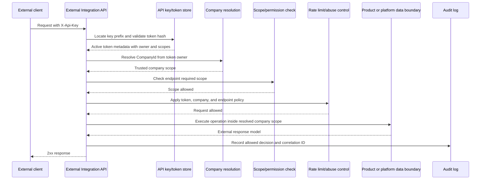
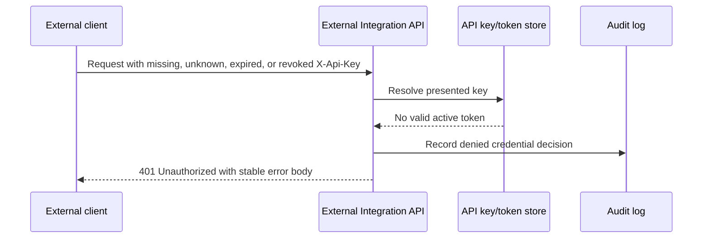
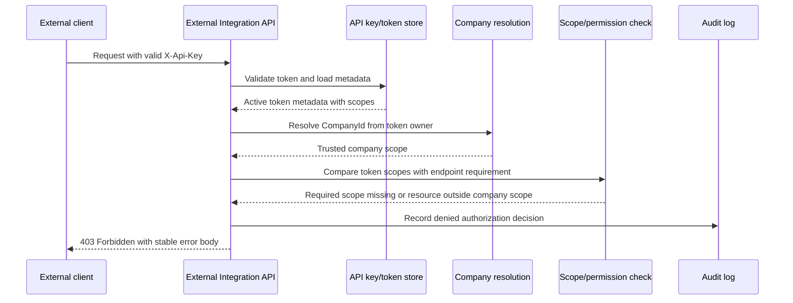
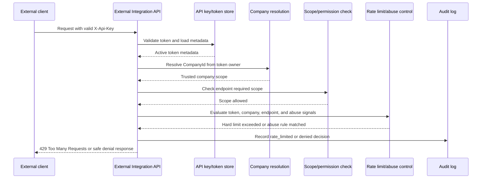

# Request Flow Diagrams

This document summarizes request handling for the illustrative external API contract. It is a documentation-first technical artifact, not a runtime implementation guide.

The diagrams show where authentication, company resolution, scope authorization, rate limiting, product or platform data access, audit logging, and client responses fit together. They intentionally stay concise and link to deeper design notes instead of repeating every operational detail.

## Related Documents

- [External API access model](external-api-access-model.md)
- [API key lifecycle](../token-lifecycle/api-key-lifecycle.md)
- [Permission model](../scopes/permission-model.md)
- [External API audit log](../auditability/external-api-audit-log.md)
- [External API rate limiting](../rate-limiting/external-api-rate-limiting.md)
- [Internal vs external API](../integration-boundaries/internal-vs-external-api.md)
- [Minimal illustrative OpenAPI contract](../../examples/openapi/external-api.sample.yaml)

## Ownership Rule

The core ownership rule is:

1. `X-Api-Key` resolves to the token owner.
2. The token owner determines the effective `CompanyId`.
3. External clients must not choose arbitrary company scope.

Client-provided identifiers can be request input, filters, or external resource references only after the platform has resolved trusted company scope from API key metadata.

## Successful External API Request

This flow demonstrates the normal request path. The external client authenticates with `X-Api-Key`, but company authority comes from stored token metadata rather than request fields. Scope checks and rate-limit policy run before product or platform data is accessed, and the final decision is recorded without logging raw API key material.

## Invalid, Expired, Revoked, or Unknown API Key

This flow shows that credential failures stop before company resolution, scope checks, rate-limit authorization, or data access. Audit records should use a non-secret token identifier or key prefix when available and classify the denial as missing, invalid, expired, revoked, or deactivated without exposing the raw token.

## Scope or Permission Denial

This flow demonstrates deny-by-default authorization. A valid token is not enough to call every endpoint. The token must include the required endpoint-level scope, and any resource access must remain inside the resolved company scope.

## Rate Limit or Abuse Detection Denial

This flow shows rate limiting after authentication and authorization context is known. Per-token, per-company, endpoint-level, and abuse-detection policies can use trusted token and company metadata, while the client receives a stable response such as `429 Too Many Requests` when a hard limit is exceeded.
