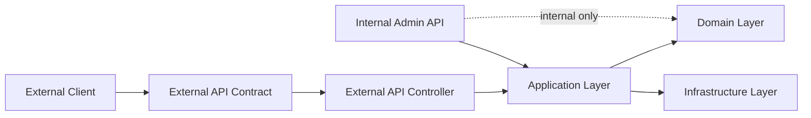

# Internal vs External API

Internal APIs are not automatically external APIs. A fintech-style platform should maintain a clear boundary between internal operational surfaces and curated external API contracts.

## Internal APIs Are Not Automatically External APIs

Internal APIs often expose implementation details that are useful inside the platform but unsuitable for external clients. They may rely on internal identity, internal roles, operational shortcuts, unstable field names, or workflows that assume trusted callers.

External APIs need a different contract:

- stable request and response models,
- explicit scopes,
- company-scoped authorization,
- predictable errors,
- versioning,
- audit behavior,
- rate-limit behavior,
- safe documentation.

The external API should be designed as a product boundary, not generated as a direct copy of internal controllers.

## External Contract Isolation

The external API contract should define what external clients can rely on. It should be intentionally smaller and more stable than internal platform APIs.

External contract isolation helps prevent:

- accidental exposure of internal fields,
- breaking changes caused by internal refactors,
- leakage of internal workflow states,
- coupling external clients to internal service boundaries,
- confusing authorization assumptions.

## DTO Isolation

External request and response DTOs should be separate from internal DTOs and domain models.

External DTOs should:

- include only documented fields,
- use stable names and types,
- avoid internal identifiers unless they are part of the external contract,
- avoid exposing internal state transitions,
- support backward-compatible additions where possible.

Internal models can change as the platform evolves. External DTOs should change deliberately and with compatibility review.

## Versioning

External APIs should use an explicit versioning strategy, such as `/external/v1/...`.

Versioning should define:

- when a new version is required,
- what changes are backward compatible,
- how deprecated fields or endpoints are communicated,
- how long older versions are supported,
- how examples and OpenAPI contracts are published.

## Backward Compatibility

Backward-compatible changes generally include:

- adding optional response fields,
- adding new endpoints,
- adding new enum values only when clients are documented to handle unknown values,
- adding optional request fields with safe defaults.

Potentially breaking changes include:

- removing fields,
- renaming fields,
- changing field types,
- changing required scopes,
- changing error codes,
- changing pagination or idempotency behavior,
- tightening validation without a migration path.

## Error Response Stability

External clients should receive stable error response shapes and stable error codes. Internal exception names, stack traces, and service-specific failure details should not leak into external responses.

Error responses should include a correlation ID so clients can provide a support reference without exposing raw request or token details.

## Swagger/OpenAPI Exposure Strategy

Internal Swagger and external OpenAPI have different audiences.

Internal Swagger is useful for local development, internal testing, and service discovery. It may include internal endpoints, operational fields, or unstable implementation details.

External OpenAPI should be curated, versioned, reviewed, and published intentionally. It should include only external endpoints, security schemes, request and response models, examples, error responses, scopes, and rate-limit guidance that external clients can rely on.

## Why Internal Swagger Should Be Local/Dev Only

Internal Swagger should usually be available only in local or controlled development environments because it can reveal:

- internal endpoint names,
- operational capabilities,
- internal model shapes,
- undocumented parameters,
- implementation-specific errors,
- sensitive workflow assumptions.

Even when internal Swagger is authenticated, it should not be treated as external customer or partner documentation.

## Why External OpenAPI Should Be Curated

External OpenAPI should be curated because it becomes a contract. It should be reviewed for:

- stable endpoint paths,
- company-scoped authorization assumptions,
- required scopes,
- safe field names,
- safe examples,
- stable error responses,
- pagination and idempotency behavior,
- rate-limit expectations.

The external contract should be generated from or aligned with implementation where possible, but publication should still be an intentional release action.

## Component Boundary

The external client sees the external API contract. The external API controller translates that contract into application-layer calls with trusted company scope and validated permissions.

The internal admin API may share application capabilities, but it should not define the external API contract.
