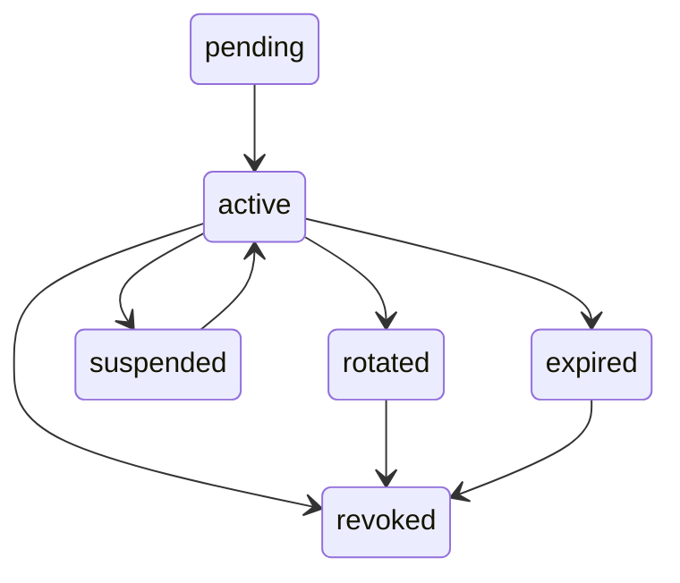

# Token lifecycle and revocation

## Purpose
External API keys need an explicit lifecycle because they grant machine-to-machine access to company-scoped fintech resources.

The lifecycle model covers:
- token issuance,
- secure storage,
- activation,
- expiry,
- rotation,
- revocation,
- last-used tracking,
- incident response.

Token lifecycle controls do not replace scope evaluation, company-boundary checks, rate limiting, or audit logging. They define whether a token identity is eligible to be evaluated; the request must still pass all other authorization and operational controls.

## Why token lifecycle matters in fintech external APIs
External clients may store credentials incorrectly. Even with clear integration guidance, partner and customer systems can mishandle secrets, copy keys across environments, or leave keys in old deployments.

Long-lived unmanaged keys increase blast radius. If a credential is leaked or forgotten, an explicit expiry and revocation model limits how long it can remain useful.

Stale integrations can keep unused access alive. Last-used tracking helps identify tokens that no longer appear to support an active integration.

Revocation must be reliable during incidents. Security and support teams need a way to stop future authorization immediately from the platform perspective.

Support and security teams need visibility into token state. They should be able to explain whether a token is pending, active, expired, suspended, rotated, or revoked.

Token ownership must remain tied to one company. Lifecycle operations should not move a token across company boundaries.

## Design goals
- **One token belongs to exactly one company**: ownership is set at issuance and remains the tenant boundary for authorization.
- **Raw API keys are shown only once at creation**: clients receive the secret once and must store it securely.
- **Raw API keys are never stored**: the platform stores only non-secret lookup material such as a hash or fingerprint.
- **Token state is explicit**: authorization checks use a clear lifecycle status, not only an implied flag.
- **Expiry is enforced at request time**: expired tokens fail even if cleanup jobs have not run.
- **Revocation is immediate from authorization perspective**: revoked tokens stop passing authorization checks without waiting for delayed operations.
- **Rotation is supported without breaking planned integrations**: clients can migrate to a replacement token through a controlled process.
- **Last-used metadata supports operations and incident response**: token activity can be reviewed without storing sensitive request details.
- **Lifecycle changes are auditable**: creation, rotation, suspension, reactivation, and revocation produce traceable events.

## Non-goals
- Replacing user authentication.
- Replacing internal IAM.
- Implementing OAuth/OIDC.
- Defining vendor-specific secret storage.
- Defining legal retention requirements.
- Providing implementation code.

## Token states
| State | Meaning | Requests allowed? | Typical transition into state | Typical transition out of state |
|---|---|---|---|---|
| `pending` | Token record exists but is not yet usable. | no | Token requested and prepared before activation. | Activate after required setup is complete, or revoke if abandoned. |
| `active` | Token may be evaluated for external API access. | yes, if all other checks pass | Token is activated after issuance or reactivated after suspension. | Expire, suspend, rotate, or revoke. |
| `expired` | Token is past its allowed lifetime. | no | Current time passes `expiresAt`. | Revoke for cleanup or issue a replacement token. |
| `revoked` | Token is permanently disabled. | no | Security action, company request, decommissioning, or hygiene process. | None for the same token; issue a new token if access is needed. |
| `rotated` | Token has been replaced by another token. | no, unless a bounded overlap policy treats it as active until cutoff | Planned rotation creates a replacement token and links records. | Revoke after old token retirement is confirmed. |
| `suspended` | Token is temporarily disabled. | no | Investigation, suspected misuse, or integration defect. | Reactivate explicitly or revoke. |

## Token lifecycle flow
1. Token requested by authorized company user or platform operator.
2. Token created using secure entropy.
3. Raw token displayed once.
4. Hash/fingerprint stored.
5. Token assigned to exactly one company.
6. Scopes assigned.
7. Expiry defined.
8. Token becomes active.
9. Token is used for external API calls.
10. Last-used metadata updated.
11. Token is rotated, expires, suspended, or revoked.
12. Audit events record lifecycle and usage decisions.

## Token metadata model
| Field | Purpose | Required? | Notes |
|---|---|---|---|
| `tokenId` | Non-secret token record identifier. | yes | Used for administration, audit events, and support references. |
| `tokenFingerprint` | Non-secret lookup or correlation value. | yes | Raw token value is not stored. |
| `companyId` | Owning company and tenant boundary. | yes | Authoritative for company-scoped access decisions. |
| `displayName` | Human-readable token label. | no | Helps operators and company users identify the integration. |
| `status` | Current lifecycle state. | yes | Use explicit states such as `active`, `expired`, `revoked`, or `suspended`. |
| `scopes` | External permissions assigned to the token. | yes | Required for endpoint authorization; review during rotation. |
| `issuedAt` | Time the token was issued. | yes | Supports lifecycle investigation and age review. |
| `expiresAt` | Time after which the token must fail authorization. | yes | Enforced at request time. |
| `lastUsedAt` | Most recent accepted usage timestamp. | no | Update according to clear policy after successful authorization or equivalent decision point. |
| `lastUsedEndpoint` | Most recent endpoint associated with accepted usage. | no | Store route pattern rather than sensitive request details. |
| `createdByActor` | Actor that requested or created the token. | yes | May be a company user, platform operator, or controlled process. |
| `revokedAt` | Time the token was revoked. | no | Required when status is `revoked`. |
| `revokedByActor` | Actor that revoked the token. | no | Required when status is `revoked`, where available. |
| `revocationReason` | Reason for revocation. | no | Required when status is `revoked`; use controlled values where possible. |
| `rotatedFromTokenId` | Previous token in a rotation chain. | no | Used on the replacement token when applicable. |
| `rotatedToTokenId` | Replacement token in a rotation chain. | no | Used on the old token when applicable. |
| `environment` | Runtime context for the token. | yes | Examples include sandbox or production. |
| `metadata` | Controlled extension fields. | no | Must not contain secrets or sensitive payloads. |

The raw token value is not stored. Metadata must not contain secrets or sensitive payloads. `companyId` is authoritative for the tenant boundary.

## Token issuance rules
- Issue only for an owning company.
- Require explicit scopes.
- Require explicit expiry.
- Show raw token only once.
- Store only hash/fingerprint.
- Record actor and reason where appropriate.
- Produce an audit event for token creation.

## Token expiry rules
- Expired tokens must fail authorization.
- Expiry is checked on every request.
- Expiry should not depend only on background cleanup.
- Clients should receive stable authentication failure semantics.
- Expired token usage should be auditable.

## Token rotation model
Rotation creates a new token while allowing planned migration. The old token should have a bounded overlap window or be revoked immediately depending on risk.

The rotated token relationship should be tracked so teams can see which token replaced another. Rotation should preserve company ownership unless access is intentionally reissued as a new token for a different company.

Scopes should be reviewed during rotation. Rotation is a useful moment to remove unneeded access rather than carrying forward every old permission automatically.

Last-used metadata helps confirm old token retirement. If the old token continues to be used after the expected migration window, teams can contact the integration owner or revoke the old token.

## Revocation model
Revocation blocks future authorization. It should not wait for delayed operational workflows.

Revoked tokens must fail even if they had valid scopes or remaining quota. Revocation should capture actor, timestamp, and reason.

Revoked token usage should trigger audit events and possible alerts.

Revocation reasons should include:
- suspected leakage,
- integration decommissioned,
- company request,
- excessive denied requests,
- repeated rate-limit abuse,
- scope reduction,
- operational mistake,
- scheduled key hygiene.

## Suspension model
Suspension is temporary access disablement. It is useful when abuse or misconfiguration is being investigated.

Suspended token usage must be denied. Reactivation should be explicit and auditable.

Suspension is different from permanent revocation. A suspended token may return to active state after review, while a revoked token should not be reused.

## Last-used tracking
Update `lastUsedAt` and `lastUsedEndpoint` after successful authorization or according to a clear policy.

Last-used metadata supports stale token detection, rotation planning, and incident timeline reconstruction. It should avoid sensitive request details.

## Relationship with company-scoped access
Token company ownership is the source of tenant context. Caller-provided `companyId` must not change token ownership.

Token lifecycle operations must not move a token between companies. If ownership needs to change, issue a new token.

## Relationship with scope and permission model
An active token does not imply endpoint access. Valid lifecycle state and required scope must both pass.

Rotation is an opportunity to reduce scopes. Revoked or expired tokens fail before scope authorization grants access.

## Relationship with audit log model
Lifecycle events should be auditable. Usage of expired, revoked, or suspended tokens should be auditable.

Token creation, rotation, suspension, reactivation, and revocation should produce audit events. Audit events must not contain raw token values.

## Relationship with rate limiting and abuse detection
Revoked tokens fail regardless of remaining quota. Repeated revoked or expired token usage is an abuse signal.

Repeated denied requests can trigger suspension or revocation review. Rate-limit abuse may become a revocation reason.

## Operational runbook scenarios
### 1. Token leaked
- **Trigger**: token exposure is reported or suspected.
- **Action**: revoke or suspend the token immediately, review recent usage, and issue a replacement only after scope and ownership review.
- **Audit expectation**: record revocation or suspension, actor, reason, timestamp, and any later denied use of the old token.
- **Follow-up**: confirm integration migration, review affected endpoints, and monitor for repeated denied use.

### 2. Integration owner leaves company
- **Trigger**: the named owner or operational contact is no longer responsible for the integration.
- **Action**: transfer operational ownership in records, review scopes, and rotate the token if storage control is uncertain.
- **Audit expectation**: record ownership metadata update and any rotation decision.
- **Follow-up**: confirm the new owner understands expiry, rotation, and incident contacts.

### 3. Client is polling too aggressively
- **Trigger**: repeated throttling or high request volume from one token or company.
- **Action**: contact the integration owner, review endpoint usage, and suspend or revoke if behavior continues or appears unsafe.
- **Audit expectation**: record throttling events and any suspension or revocation decision.
- **Follow-up**: confirm client backoff behavior and tune endpoint expectations if legitimate usage changed.

### 4. Token is unused for a long period
- **Trigger**: `lastUsedAt` shows no recent accepted usage.
- **Action**: contact the owner, shorten expiry, suspend, or revoke according to policy.
- **Audit expectation**: record lifecycle change and reason.
- **Follow-up**: remove stale scopes or issue a new token if the integration is revived.

### 5. Company requests access removal
- **Trigger**: company asks to remove external API access for an integration.
- **Action**: revoke the token and confirm no other active tokens provide the same access unintentionally.
- **Audit expectation**: record revocation with company-request reason and actor.
- **Follow-up**: monitor for denied use of the revoked token and update integration records.

## Common mistakes
- Storing raw API keys.
- Allowing tokens without expiry.
- Sharing one token across companies.
- Changing token company ownership after issuance.
- Relying only on database cleanup for expiry.
- Treating `IsActive` as the only lifecycle control.
- Revoking without recording reason.
- Rotating without retiring old token.
- Not auditing lifecycle changes.
- Keeping broad scopes during rotation without review.

## Implementation notes
This model is language-agnostic and conceptual. It does not define application code.

Implementations may use a token registry, secure hash lookup, lifecycle status checks, and audit events depending on platform architecture. The model does not prescribe a specific vendor or framework.
