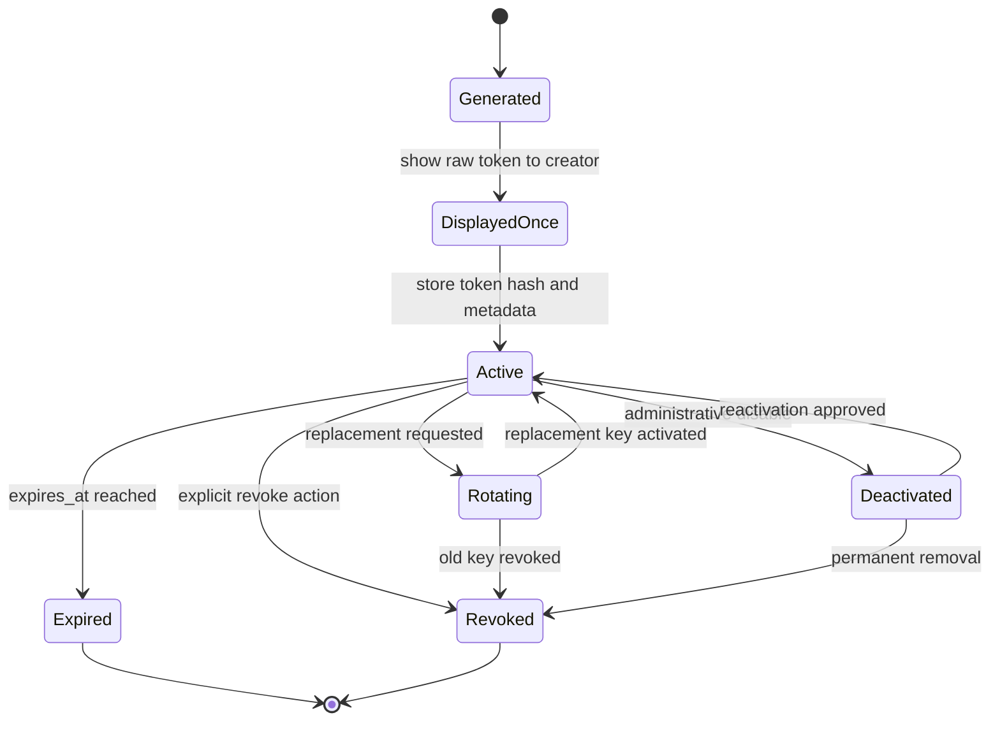

# API Key Lifecycle

API keys should have an explicit lifecycle from generation to retirement. The lifecycle must support secure issuance, one-time display, hashed storage, rotation, revocation, expiry, deactivation, and auditability.

This document is implementation-neutral and does not prescribe a specific cryptographic library or database schema.

## Lifecycle Overview

## Generate

The platform generates API key tokens. External clients should not bring their own raw token values.

Generation should produce:

- a raw token value for one-time display,
- a stable key record identifier,
- a short key prefix or identifier for lookup and support,
- token metadata, including company scope, scopes, status, and expiry.

The raw token should be long, random, and suitable for use as a bearer credential. The exact generation mechanism should be selected and reviewed by the implementation team.

## Display Once

The raw API key token should be displayed only once at creation time. After the creator leaves the creation screen, the platform should not be able to reveal the raw token again.

If an external client loses the token, the expected recovery path is rotation or replacement, not retrieval.

## Store Only Hashed Token

The platform should store only a token hash, never the raw token. The stored hash is used to validate future requests.

Logs, audit events, telemetry, error responses, and support tools must not include raw token values.

## Prefix / Key Identifier Strategy

A key prefix helps locate candidate key metadata without scanning every stored token hash. The prefix is not a secret and must not be sufficient to authenticate a request.

Example strategy:

- token format includes a short prefix and a secret token segment,
- the prefix maps to a small set of candidate records,
- the secret token segment is validated against the stored token hash,
- support views show the prefix, key name, status, and timestamps, but not the raw token.

## Rotate

Rotation creates a replacement key and transitions clients away from the old key.

A practical rotation flow:

1. Create a new key with the intended scopes and expiry.
2. Display the new raw token once.
3. Allow a short overlap period if operationally required.
4. Track usage of both the old and new key identifiers.
5. Revoke or expire the old key after migration.

Rotation should be auditable and should identify the actor or system that initiated it.

## Revoke

Revocation permanently disables an API key before its natural expiry.

Revocation should be used when:

- a token may be exposed,
- an integration is retired,
- a company relationship changes,
- a key was created with incorrect scopes,
- unusual usage suggests abuse or compromise.

Request authorization must reject revoked keys immediately.

## Expire

Expiration automatically invalidates a key at `expires_at`. Expiry reduces long-lived credential risk and supports planned credential hygiene.

Expiration behavior should be predictable:

- expired keys are denied at request time,
- external clients receive a stable unauthorized error response,
- audit logs record the expired decision,
- operators can distinguish expired keys from revoked or invalid keys.

## Deactivate

Deactivation is an administrative pause that disables a key without necessarily making a permanent security statement.

Use deactivation for temporary operational holds, investigation windows, or policy checks. Reactivation should require an explicit approved action and should be audited.

## Audit Token Events

Audit logs should record lifecycle events, including:

- key generated,
- raw token displayed once,
- key activated,
- key rotated,
- key revoked,
- key expired,
- key deactivated,
- key reactivated,
- denied request due to invalid, revoked, expired, or deactivated status.

Audit records should include token identifier or key prefix, company scope, actor where available, timestamp, decision result, and correlation ID. They should not include raw tokens.

## Example Metadata Fields

| Field | Description |
|---|---|
| `id` | Stable API key record identifier. |
| `company_id` | Owning company scope resolved during external API authorization. |
| `key_prefix` | Non-secret lookup and support identifier. |
| `token_hash` | Stored hash of the raw token. |
| `name` | Human-readable key label. |
| `scopes` | Endpoint-level permissions granted to the key. |
| `status` | Lifecycle status such as `active`, `revoked`, `expired`, or `deactivated`. |
| `created_at` | Creation timestamp. |
| `expires_at` | Optional planned expiry timestamp. |
| `revoked_at` | Timestamp for explicit revocation. |
| `last_used_at` | Last successful or attempted usage timestamp, depending on policy. |

## Operational Failure Cases

Common failure cases should have defined outcomes:

| Failure case | Expected handling |
|---|---|
| Lost raw token | Create a replacement key and revoke the old key if needed. |
| Token accidentally logged by a client | Treat as potential exposure and rotate or revoke. |
| Unknown prefix | Deny without revealing whether any similar key exists. |
| Hash mismatch | Deny and audit as invalid credentials. |
| Expired key used | Deny and audit as expired. |
| Revoked key used | Deny and audit as revoked. |
| Deactivated key used | Deny and audit as deactivated. |
| Scope removed during active use | Deny newly unauthorized endpoints and audit the denied request. |
| Rotation overlap abused | Shorten overlap, revoke the old key, and review rate-limit and audit signals. |
