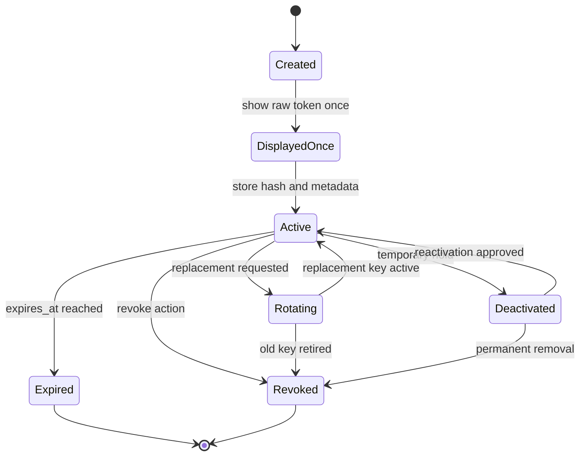

# API Key Lifecycle

This document describes an illustrative lifecycle model for company-scoped API keys in a fintech-style external API reference architecture. It is a non-production reference and stays at the design level: it does not prescribe a vendor-specific database, key management service, queue, or cloud implementation.

The lifecycle supports token creation, one-time display, hashed storage, ownership by company, activation, expiry, revocation, rotation, denied request handling, and auditability.

## Related Documents

- [Request flow diagrams](../architecture/request-flow.md)
- [Threat model](../threat-model.md)
- [Permission model](../scopes/permission-model.md)
- [External API audit log](../auditability/external-api-audit-log.md)
- [External API rate limiting](../rate-limiting/external-api-rate-limiting.md)
- [Internal vs external API](../integration-boundaries/internal-vs-external-api.md)
- [Minimal illustrative OpenAPI contract](../../examples/openapi/external-api.sample.yaml)

## Ownership Rule

The core ownership rule is:

1. `X-Api-Key` resolves to a token record.
2. The token record has an owning company.
3. The owning company determines the effective `CompanyId`.
4. External callers must not choose arbitrary company scope.

Caller-provided company identifiers can be request input only after the platform has resolved trusted company scope from token metadata. They must not override the token owner's company.

## Lifecycle Overview

The request-time flow validates the presented key before company resolution, scope checks, rate-limit decisions, or product data access. See the [invalid, expired, revoked, or unknown API key flow](../architecture/request-flow.md#invalid-expired-revoked-or-unknown-api-key) for the denial path.

## Token Creation

The platform creates API key records. External clients should not bring their own raw token values.

Creation should define:

- stable token record identifier,
- non-secret key prefix or lookup identifier,
- owning company,
- initial scopes,
- status,
- optional expiry,
- creation timestamp,
- lifecycle actor or initiating system where available.

The raw token value is generated for the client-facing credential. The implementation should select an appropriate generation mechanism during security review, but this reference does not prescribe one.

## One-Time Token Display

The raw API key should be displayed only once during creation or replacement. After the creator leaves that flow, the platform should not be able to reveal the raw token again.

If a client loses the raw token, the expected recovery path is replacement or rotation, not retrieval.

The one-time display event should be auditable without storing the raw token.

## Hashing and Storage Boundary

The platform should store only a token hash or equivalent verification artifact, never the raw token.

The storage boundary should keep raw tokens out of:

- persistent storage,
- application logs,
- audit records,
- telemetry,
- error responses,
- support tooling.

A key prefix can help locate candidate records without scanning every token hash. The prefix is not secret and must not be sufficient to authenticate a request.

## Token Ownership by Company

Each external API key belongs to one company. The token record is the platform-controlled source for ownership metadata.

Ownership drives:

- effective `CompanyId`,
- endpoint-level scope checks,
- audit attribution,
- per-company and per-token rate limits,
- lifecycle operations such as rotation and revocation,
- investigation of suspicious or denied requests.

A token should not be treated as a portable global credential. If another company needs access, it should receive a separate company-owned token record.

## Activation

A token becomes active only after its hash and metadata are stored and the raw token has completed the one-time display path.

An active token is still subject to request-time checks:

- presented token matches the stored verification artifact,
- token status is active,
- token is not expired or revoked,
- token owner resolves to the effective company scope,
- endpoint required scope is present,
- rate-limit and abuse controls allow the request.

Activation should produce an audit event with a token identifier or key prefix, owning company, lifecycle action, timestamp, actor where available, and correlation ID where useful.

## Expiry

Expiration automatically denies a key at or after `expires_at`. Expiry reduces long-lived credential risk and supports planned credential hygiene.

Expected expiry behavior:

- expired keys are denied at request time,
- company scope is not used to access product data after expiry denial,
- clients receive a stable unauthorized response,
- audit logs record an expired or denied credential decision,
- operators can distinguish expired keys from unknown, revoked, or deactivated keys.

Clients should rotate before planned expiry when they need uninterrupted access.

## Revocation

Revocation permanently disables an API key before its natural expiry.

Use revocation when:

- a token may have leaked,
- an integration is retired,
- a company relationship or access grant changes,
- a key was issued with incorrect scopes,
- unusual usage suggests abuse or replay.

Request authorization must reject revoked keys immediately. Revoked-key attempts should be audited and can feed rate-limit or abuse-detection signals.

## Rotation

Rotation creates a replacement token and moves the client away from the old token.

A practical rotation flow:

1. Create a replacement key with intended owner, scopes, status, and expiry.
2. Display the replacement raw token once.
3. Allow a short overlap window only when operationally needed.
4. Track usage of old and new key identifiers.
5. Revoke or expire the old key after migration.

Rotation should be auditable. If the old token continues to be used after the expected transition window, the attempts should be visible through audit events and operational monitoring.

## Deactivation

Deactivation is a temporary administrative hold. It can be useful during investigation, policy review, or temporary operational pauses.

Deactivated keys should be denied at request time. Reactivation should require an explicit approved action and should create a lifecycle audit event.

## Denied Request Handling

Credential denial should happen before company-scoped data access.

Common denial cases:

| Case | Expected handling |
|---|---|
| Missing API key | Return a stable unauthorized response and audit when policy requires. |
| Unknown prefix or token record | Deny without revealing whether similar keys exist. |
| Hash mismatch | Deny and audit as invalid credentials. |
| Expired key | Deny and audit as expired or denied credential usage. |
| Revoked key | Deny and audit as revoked or denied credential usage. |
| Deactivated key | Deny and audit as deactivated or denied credential usage. |
| Removed scope | Deny with a stable forbidden response and audit the missing-scope decision. |
| Rate-limit or abuse policy match | Return a stable rate-limit or safe denial response and audit the decision. |

Client-facing errors should follow the external contract and avoid exposing raw token details, token hashes, internal exception names, or sensitive operational state. The [OpenAPI sample](../../examples/openapi/external-api.sample.yaml) illustrates stable `401`, `403`, and `429` response shapes.

## Audit Events

Audit logs should record lifecycle events and request-time decisions that matter for investigation.

Lifecycle events include:

- token created,
- raw token displayed once,
- token activated,
- token rotated,
- token expired,
- token revoked,
- token deactivated,
- token reactivated.

Request-time events include:

- successful request using a token identifier,
- invalid or unknown key denial,
- expired key denial,
- revoked key denial,
- deactivated key denial,
- missing-scope denial,
- rate-limited or abuse-denied request.

Audit records should include safe metadata such as token identifier or key prefix, owning company, resolved `CompanyId` when available, endpoint route template, required scope, decision result, error classification, timestamp, actor where available, and correlation ID. They should not include raw tokens, token hashes, full sensitive request bodies, or full sensitive response bodies.

## Example Metadata Fields

| Field | Description |
|---|---|
| `id` | Stable token record identifier. |
| `company_id` | Owning company used to determine effective request scope. |
| `key_prefix` | Non-secret lookup and support identifier. |
| `token_hash` | Stored verification artifact for the raw token. |
| `name` | Human-readable key label. |
| `scopes` | Endpoint-level permissions granted to the key. |
| `status` | Lifecycle status such as `active`, `expired`, `revoked`, or `deactivated`. |
| `created_at` | Creation timestamp. |
| `activated_at` | Activation timestamp. |
| `expires_at` | Optional planned expiry timestamp. |
| `revoked_at` | Revocation timestamp. |
| `last_used_at` | Last successful or attempted usage timestamp, depending on policy. |

## Design-Level Review Checklist

- [ ] Does `X-Api-Key` resolve to exactly one token record before company scope is trusted?
- [ ] Is the owning company stored in platform-controlled token metadata?
- [ ] Are raw tokens displayed once and excluded from storage, logs, audit records, and support views?
- [ ] Are token status, expiry, and revocation checked at request time?
- [ ] Are scopes reviewed at creation and rotation?
- [ ] Are unknown, expired, revoked, and deactivated key attempts denied before data access?
- [ ] Are lifecycle changes and denied requests auditable with safe metadata?
- [ ] Are repeated denied attempts visible to rate-limit or abuse-detection controls?
